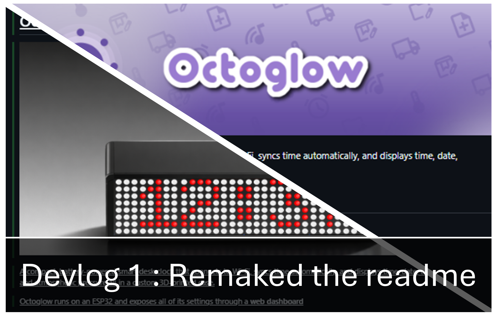
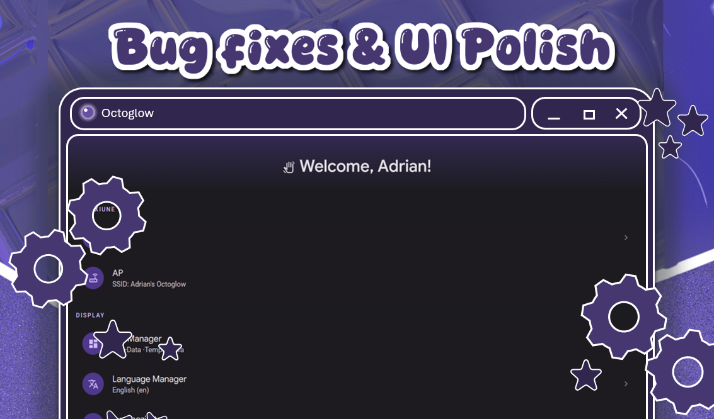
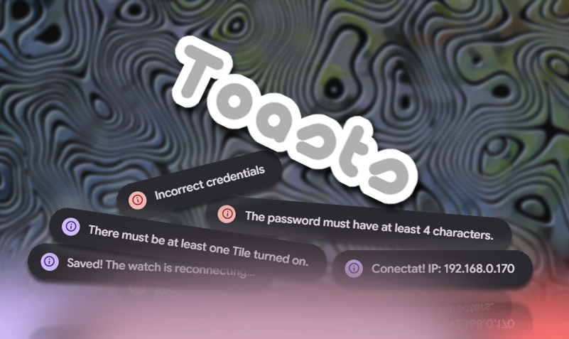

# Devlog 1: Fixed the readme

Previously, my readme was written by ai, so it wasn't really that great. It contained a lot of false information about my project, so I decided to remake it, keeping only a few accurate parts from the previous version.
This update adds a lot of images and examples, as well as a banner, making the readme much more pleasant to look at. It took me quite a while to finish, but I'm really satisfied with the final result.

# Devlog 2: UI inconsistency error fixes + WiFi sync bug fix

1. UI inconsistency error fixes
- I tried to identify and fix all of them since in future versions we will be able to set the accent color for the interface
Below are all the fixes for the UI inconsistencies:
 - In Tile Manager: In the "Display Settings" category (My Project is still in Romanian and English, I will do a fix for that later) Tile Transition and Scroll Type used a different category opening arrow than the one on Disable Tile Icons, now they all look the same
 - In the "Switch to AP Mode" popup, the icon on the left and the confirmation button were red, which made the UI a bit inconsistent, now they follow the current accent color
 - In the About category, both Info and Software showed the version info, now it's only in Software, and the order was changed to Info, User, Software
 - In Display, in the "Brightness" category, the brightness icon had a smaller blade than the rest

2. Octoglow WiFi information sync errors

In the past, the firmware had a problem where if /state failed even once (a network blip on the ESP32), the page would permanently fall back to a reduced hardcoded list (without Pressure/Screensaver/Currency) and would stop updating IP/WiFi/version at all, which is why it only worked after a restart, since that redid the fetch
Fix applied: now, if /state fails, the page automatically retries up to 4 times (with increasing delay: 0.5s, 1s, 1.5s, 2s) before falling back to the incomplete fallback. This basically removes the need for a manual restart in unfavorable cases

# Devlog 3: Text Engine Fixes

1. Tile Font Inconsistency
Before this fix, the timer, stopwatch, memento, and currency tiles used a different numeric font than the rest of the tiles, something I hadn't noticed until now. As of this update, all tiles now display using the same font.

Before

.jpeg>)

After

.jpeg>)

2. Toasts
In previous versions, when logging into the interface, we had no dedicated way to communicate short lived pieces of information, so these messages were scattered around and didn't look good. Starting with this update, the web interface now has the ability to display toasts (a feature I mainly integrated to warn the user that they cannot have 0 active circuit tiles, and that at least one tile of that kind needs to be turned on for the firmware to work correctly. However, I saw an opportunity in this, so I integrated it in other places as well).

Places where we now have toasts:
Failed Login
Successful Wifi Connection
Circuit Tile Exception
AP Mode Switch

# 4.
fix animation tranzion on single circuit tile on
Add to touch actions on touch show ip adress
