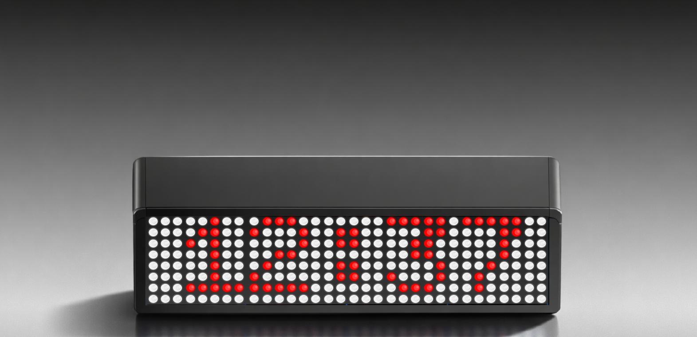
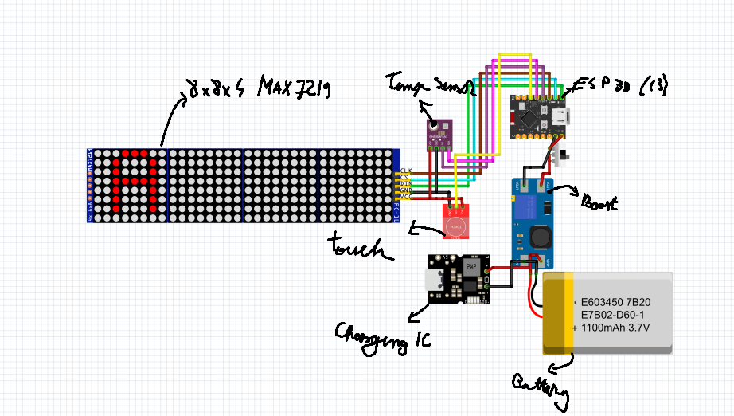

# Octoglow





A compact, battery-powered smart desk clock that connects to Wi-Fi, syncs time automatically, and displays time, date, temperature, and atmospheric pressure  all in a custom 3D-printed case.

Octoglow runs on an ESP32 and exposes all of its settings through a **web dashboard** 

---

## Table of Contents

- [Features](#features)
- [Compatibility](#compatibility)
- [Schematics](#schematics)
- [Wiring](#wiring)
- [Bill of Materials (BOM)](#bill-of-materials-bom)
- [Firmware Setup](#firmware-setup)
- [Setting Up ETS2 Speed Integration](#setting-up-ets2-speed-integration)


## Features

###  Tiles (display slots)

Octoglow displays information in "tiles" that rotate one after another, each with its own display duration, all configurable from the dashboard (you can enable/disable each tile and reorder them via drag & drop):

| Tile | Description |
|---|---|
| **Clock** | 12h/24h format, configurable |
| **Date** | Multiple date formats available |
| **Temperature** | Read from the BMP280 sensor, in °C or °F |
| **Atmospheric Pressure** | Read from the BMP280 sensor (hPa) |
| **Now Playing** | Shows the song currently playing on your PC (artist + title) |
| **Weather** | Current weather for a city searched from the dashboard, with multi-language support |
| **Currency Standards** | Live exchange rates |
| **Memento** | A short, custom text entered manually from the dashboard (e.g. reminders) |
| **Canvas** | Static 8×32 pixel drawing, hand-drawn on an interactive grid in the dashboard |
| **Screen Saver** | Pixel-art animations for idle moments: Random, Pong, Fireworks, Equalizer |
| **PC Notifications** | Windows notifications, sent live from your computer (see section below) |
| **Stopwatch** | Started/stopped from the dashboard |

All text-based tiles have an individually configurable scroll style  **Bounce** (back-and-forth) or **Wrap** (continuous scroll), with or without a visible icon.

Some tiles (Notifications, ETS2, Stopwatch) can be set as **priority tiles**  they interrupt the normal rotation and appear immediately whenever they have something new to show.

###  Brightness & Dimming

- 17 brightness levels (0 = display fully off, 1-16 = actual intensity on the MAX7219 matrix).
- **Scheduled auto-dimming**: set a time window (e.g. 10 PM - 7 AM) during which the display automatically switches to a lower brightness, so it doesn't blind you at night.

###  Touch Sensor

A TTP223 capacitive sensor enables physical interaction with the clock, with separately configurable actions for **tap** and **double tap**:

- Do nothing
- Previous / next tile
- Turn screen on/off
- Increase / decrease brightness
- Mute / unmute buzzer
- Restart ESP32

###  Buzzer & Event Sounds

- Buzzer on/off, with adjustable volume.
- Sound presets: Calm, Loud, Urgent, Soft, Double Beep, Triple Beep.
- Separately configurable sounds for each event type: tile switching, Wi-Fi disconnection, new notification, ETS2 speeding, touch sensor tap  with a wider tone library available here too (Chime, Bell, Doorbell, Xylophone, Harp, Marimba, etc.).

###  Wi-Fi & Access Point

- Connects to your Wi-Fi network (STA mode) via in-browser provisioning: network scan, password entry.
- If no Wi-Fi is configured (or if you choose to switch manually), it starts its own **AP hotspot** (defaults to "Adrian's Octoglow"), with a configurable SSID and password, for direct access to the dashboard.
- You can switch between AP mode and Wi-Fi mode from the dashboard at any time.
- Automatic timezone handling via a built-in **IANA → POSIX** lookup table with ~119 zones (covers virtually every region in the world), no manual DST configuration needed.

###  Account & Authentication

The dashboard is protected with a username + password (cookie-based session). You can change your username and password anytime from the account section.

### OTA (Over-The-Air) Updates

The firmware can check its own version against the GitHub repo and update itself wirelessly, straight from the dashboard:

1. The clock reads the published version from the repo and compares it against the installed version (`FW_VERSION`).
2. If a newer version is available, the dashboard shows the changelog and an install button.
3. The update (`.bin`) is downloaded and flashed onto the ESP32 via the `Update` library, followed by an automatic restart.

###  Stopwatch & Timer

- **Stopwatch**: start/stop from the dashboard, shown as a priority tile while running.
- **Timer**: configurable countdown, with start/pause and a sound notification on expiry.

### Weather & Currency

- Search for a city from the dashboard (with a configurable display language) and show the current weather.
- Live exchange rate for the currencies you choose.

### PC Integration

Through the included Python script (`Octoglow_sender.py/.exe`), the clock can display in real time:
- The song currently playing on your PC (Now Playing)
- Windows notifications
- Speed data from Euro Truck Simulator 2 (live telemetry)

---

## Compatibility

The firmware should work on any ESP board, although it was tested on the following boards:

- ESP32-S3
- ESP32-C3

## Schematics

Here is a full schematic you can build if you want your Octoglow to run on battery
(the battery circuit is optional and can be skipped).



## Wiring

| Component | ESP32-C3 Pin |
|---|---|
| MAX7219 DIN | GPIO7 |
| MAX7219 CLK | GPIO6 |
| MAX7219 CS | GPIO5 |
| BMP280 SDA | GPIO8 |
| BMP280 SCL | GPIO9 |
| TTP223 OUT | GPIO4 |
| Touch I/O | GPIO10 |
|Buzzer| GPIO7|
---

## Bill of Materials (BOM)

| Item | Description | Qty | Unit Price ($) | Total ($) | URL |
|------|-------------|:---:|---------------:|----------:|-----|
| LED Matrix 4x MAX7219 | 4-in-1 chained MAX7219 red LED matrix module | 1 | $6.98 | $6.98 | [Link](https://sigmanortec.ro/en/led-matrix-module-4x-max7219-red) |
| ESP32-C3 SuperMini | WiFi/BT microcontroller board 3.3V | 1 | $6.09 | $6.09 | [Link](https://sigmanortec.ro/en/esp32-c3-supermini-development-board-33v-wifi-bluetooth) |
| TTP223 Touch Sensor | Capacitive touch button module | 1 | $0.69 | $0.69 | [Link](https://sigmanortec.ro/en/capacitive-button-ttp223-touch) |
| TP4056 + Boost 5-24V | Battery charger with boost converter 5-24V | 1 | $1.75 | $1.75 | [Link](https://sigmanortec.ro/modul-incarcare-baterie-cu-ridicator-5-24v-tp4056) |
| IP2312 Charger USB-C 3A | Li-Ion charger 5V→4.2V CC/CV Type-C 3A QC | 1 | $2.75 | $2.75 | [Link](https://sigmanortec.ro/modul-incarcare-litiu-5v-la-42v-ip2312-cv-cc-type-c-3a-qc) |
| Mini Switch | Small slide switch, 2 positions | 1 | $0.22 | $0.22 | [Link](https://sigmanortec.ro/en/mini-switch-2-positions) |
| 18650 2500mAh x2 | Samsung 25R 18650 3.7V 2500mAh - set of 2 | 1 | $15.55 | $15.55 | [Link](https://sigmanortec.ro/set-2-acumulator-li-ion-25r-18650-37v-2500mah-8c) |
| BMP280 Sensor 5V | Pressure and temperature sensor 5V | 1 | $2.03 | $2.03 | [Link](https://sigmanortec.ro/en/pressure-and-temperature-sensor-bmp280-5v) |
| 3D Printing | Custom 3D printed case (Printing Legion) | 1 | $12.00 | $12.00 | - |
| **TOTAL** | | | | **$48.06** | |

---

## Firmware Setup

1. Open `Octoglow.ino` in the Arduino IDE
2. Install the ESP32 board package from Boards Manager, if you don't have it yet.
3. Install the required libraries from the Library Manager:
   - `MD_Parola`
   - `MD_MAX72xx`
   - `Adafruit_BMP280`
   - `ArduinoJson`
   - (`WiFi`, `SPI`, `Wire`, `WebServer`, `Preferences`, `HTTPClient`, `Update`, `StreamString`, and `mbedtls` are already bundled with the ESP32 core)
4. Select your board (ESP32-S3 / ESP32-C3) and the correct serial port.
5. Upload the firmware.
6. On first boot, the clock starts in **AP mode**  connect to its Wi-Fi network and open `192.168.4.1` in your browser to set up its connection to your home network.

---

## PC Integration (`Octoglow_sender.py/.exe`)

The `Octoglow_sender.py` script runs on Windows and sends live data to the clock over HTTP, using the dashboard's own username/password authentication (session cookie, with automatic re-login if it expires).

### What it does

- **Now Playing**  detects the song currently playing on your PC (Spotify, browser, etc.) via the Windows Media Session and sends it every few seconds.
- **Windows Notifications**  listens for toast notifications on Windows and forwards them to the clock (with automatic diacritics removal and truncation to a maximum character count).
- **Euro Truck Simulator 2**  if the game is running, reads live telemetry (current speed) and streams it to the clock in real time. Requires an extra one-time plugin install in-game  see [Setting Up ETS2 Speed Integration](#setting-up-ets2-speed-integration).

### Dependencies

```bash
pip install requests
pip install winrt-Windows.Media.Control winrt-Windows.Foundation
pip install winrt-Windows.UI.Notifications.Management
pip install winrt-Windows.UI.Notifications
pip install winrt-Windows.Foundation.Collections
pip install winrt-Windows.ApplicationModel   # optional, for the app name
pip install truck-telemetry   # for ETS2  also requires the scs-sdk-plugin installed in-game
pip install psutil            # for detecting the eurotrucks2.exe process
```

### Configuration

Open `Octoglow_sender.py` and fill in at the top of the file:

```python
ESP32_IP = ""   # your clock's IP address
SC_USER  = ""   # your dashboard username
SC_PASS  = ""   # your dashboard password
```

---

## Setting Up ETS2 Speed Integration

The ETS2 tile shows your truck's current speed on the clock, but it needs one extra piece set up in-game before it works: ETS2 doesn't expose any telemetry data on its own  a small plugin has to be installed first.

### 1. Install the SCS SDK plugin (in-game)

1. Download the latest **scs-sdk-plugin** (by RenCloud) from:
   `https://github.com/RenCloud/scs-sdk-plugin/releases`
    grab the Windows archive (`win_x64`).
2. Open your ETS2 install folder. By default it's:
   ```
   C:\Program Files (x86)\Steam\steamapps\common\Euro Truck Simulator 2\bin\win_x64\plugins
   ```
   Create the `plugins` folder if it doesn't exist yet.
3. Copy the `.dll` from the downloaded archive into that `plugins` folder.
4. Launch ETS2. On first launch you may see a confirmation message that the SDK was enabled  click OK.

> If you don't see the confirmation message, make sure the DLL sits directly in `bin\win_x64\plugins\`, not in a subfolder.

### 2. Install the `truck-telemetry` Python package

On the same PC that runs ETS2:

```bash
pip install truck-telemetry requests
```

This package reads the data exposed by the plugin above through a shared-memory file (`Local\SCSTelemetry`).

### 3. Point the sender script at your clock

In `Octoglow_sender.py`, make sure `ESP32_IP` matches your clock's actual IP address (you can find it in the clock's dashboard, under the Wi-Fi section).

### 4. Run it

1. Launch **Euro Truck Simulator 2**.
2. Get into the cab and start driving  telemetry only becomes valid once you're actually "in game," not sitting in the main menu.
3. On your PC, run:
   ```bash
   python Octoglow_sender.py
   ```

If everything's working, you'll see this in the console:
```
[ETS2] eurotrucks2.exe detected  connected to telemetry.
[ETS2 ] 0 km/h
[ETS2 ] 23 km/h
[ETS2 ] 47 km/h
...
```

On the clock, the ETS2 tile will appear with a truck icon and the current speed, interrupting the normal rotation (Clock/Date/Temperature/etc).

### How the tile behaves

- **Appears automatically** as soon as the script starts sending data, for as long as you're in-game (speed 0 or not).
- **Updates live** every time the speed changes (read interval: 0.5s).
- **Disappears automatically** and hands back control to the normal rotation if the Python script is stopped, or if the game is closed or minimized for more than **5 seconds** (built into the firmware as a timeout).
- If you get a **Windows notification** while driving, the notification takes priority and is shown over the ETS2 tile for its duration, then ETS2 resumes.

Made with 🖤 by Adrian
